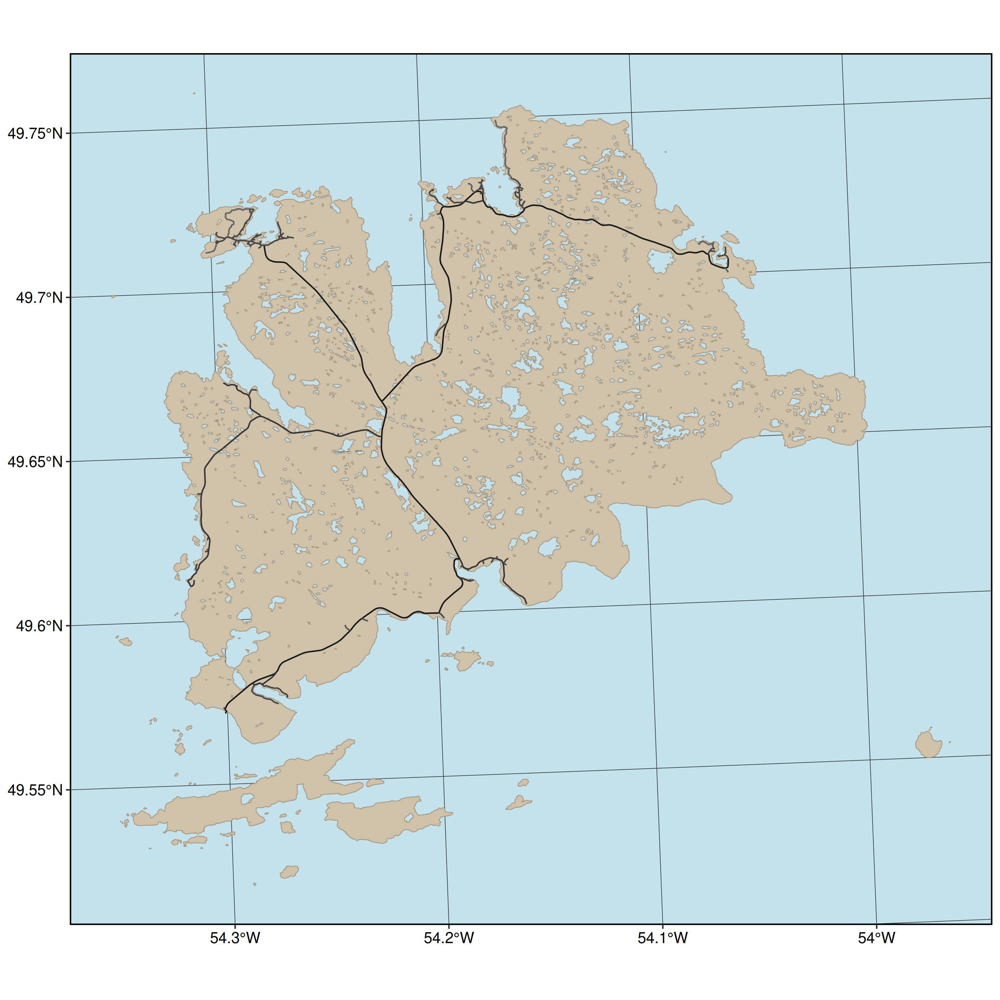
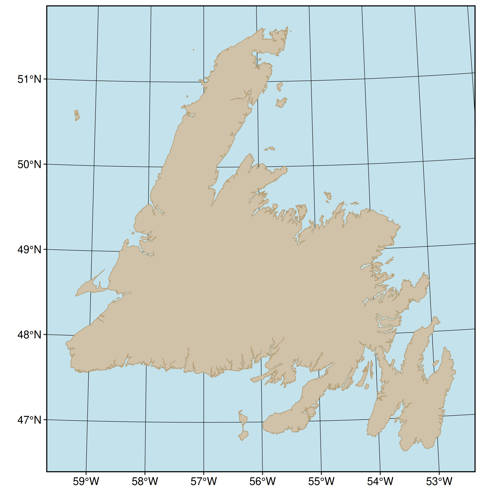
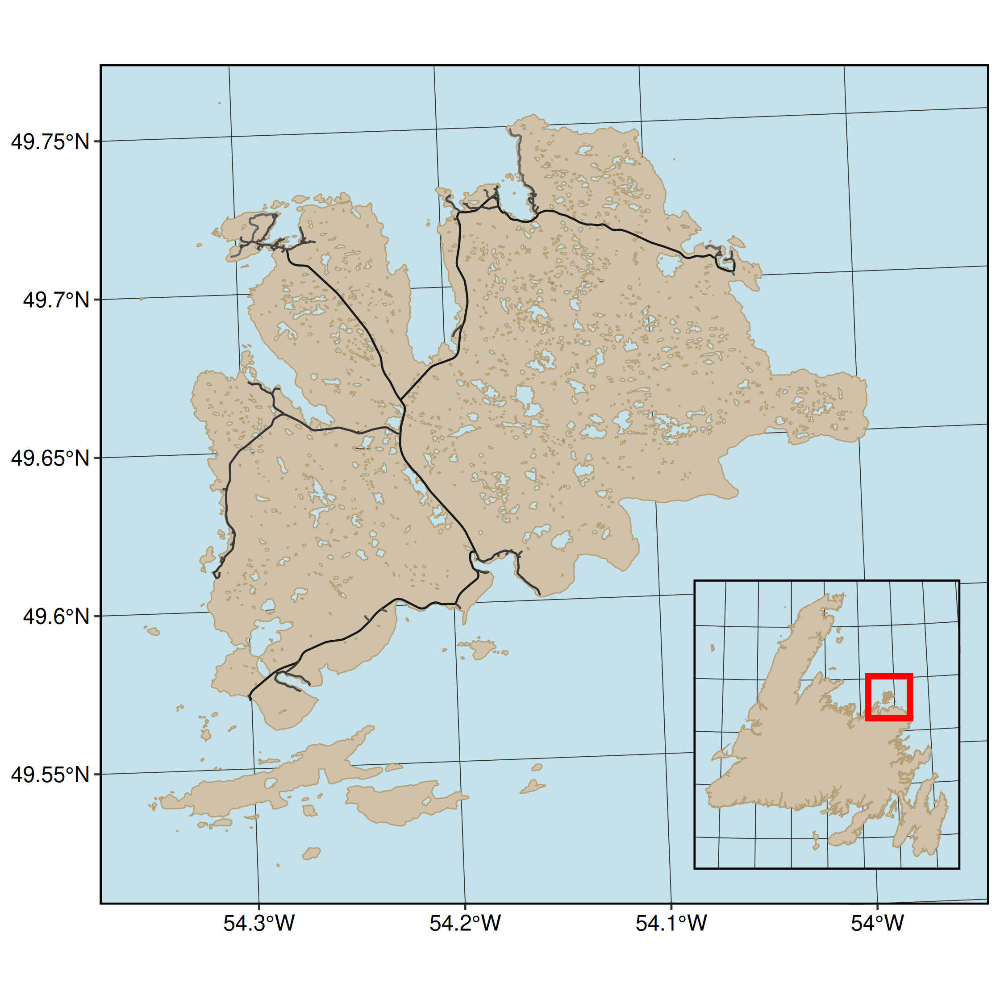

# study-area-figures

Collecting WEEL study area figures in one place, for sharing! 


## Contributing:
1. Clone the repository
2. Add your script (follow the numbering scheme)
3. Add the output figure to `graphics/`, with a name and number matching the script it originates from. 
4. (Ideally) add the figure to the `README.Rmd` so we can preview them all together in one spot. 

**Note: currently the input folder is ignored, if you have small data you'd like to share, carefully remove it from the `.gitignore`**

Also, we output the features to `.gpkg` (GeoPackage) because... [shapefiles are hell](http://switchfromshapefile.org).

## Currently:
1. Fogo Island

This uses data from Open Street Map and four packages: `osmdata`, `sf`, `data.table` and `ggplot`. 


Reproducing: run `01-fogo-island-prep.R` to generate the islands polygon and `02-fogo-island-figure.R` to generate the figure. 


```{r}

```

2. Newfoundland 

This uses data from Open Street Map and four packages: `osmdata`, `sf`, `data.table` and `ggplot`. 


Reproducing: run `03-newfoundland-prep.R` to generate the islands polygon and `04-newfoundland-figure.R` to generate the figure. 

```{r}

```


3. Fogo with Newfoundland inset 

This uses data from Open Street Map and four packages: `osmdata`, `sf`, `data.table` and `ggplot`. 


Reproducing: run `01-fogo-island-prep.R`, `03-newfoundland-prep.R`, to generate the Fogo and NL polygons and `04-fogo-inset-newfoundland-figure.R` to combine and generate the figure. 

```{r}

```
