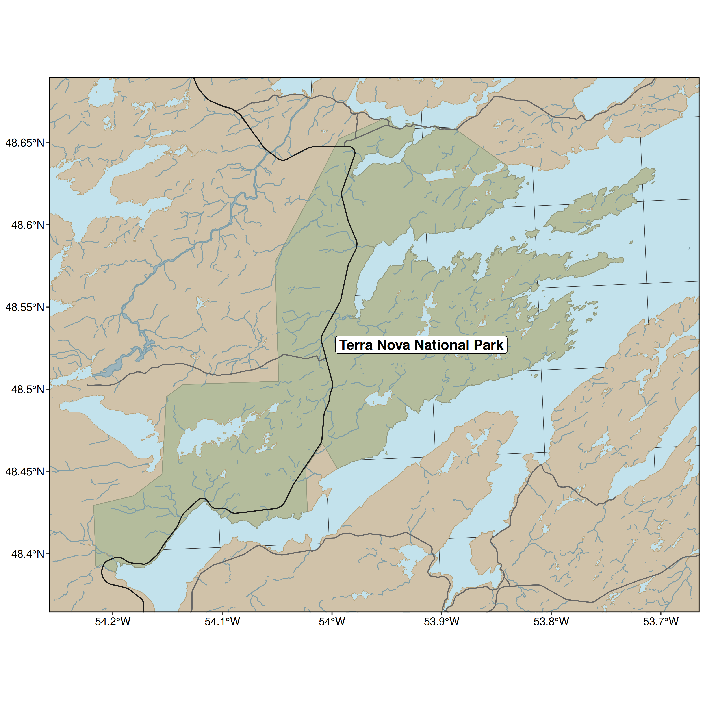

# study-area-figures

Collecting WEEL study area figures in one place, for sharing! 


## Contributing:
1. Clone the repository
2. Add your script (follow the numbering scheme)
3. Add the output figure to `graphics/`, with a name and number matching the script it originates from. 
4. Add the figure to the `README.Rmd` so we can preview them all together in one spot. 

**Note: currently the input folder is ignored, if you have small data you'd like to share, carefully remove it from the `.gitignore`**

Also, we output the features to `.gpkg` (GeoPackage) because... [shapefiles are hell](http://switchfromshapefile.org).

Also! I made a bash script for rerunning all the figures. If you want to try it, let me know. 

## Study area figures
1. Fogo Island

This uses data from Open Street Map and packages: `osmdata`, `sf`, `data.table` and `ggplot`. 


Reproducing: run `01-fogo-island-prep.R` to generate the islands polygon and `02-fogo-island-figure.R` to generate the figure. 


```{r}
knitr::include_graphics('graphics/02-fogo-island.png')
```

2. Newfoundland 

This uses data from Open Street Map and packages: `osmdata`, `sf`, `data.table` and `ggplot`. 


Reproducing: run `03-newfoundland-prep.R` to generate the islands polygon and `04-newfoundland-figure.R` to generate the figure. 

Note: this map doesn't show internal water. Let me know if that's something you'd like to add.

```{r}
knitr::include_graphics('graphics/04-newfoundland.png')
```


3. Fogo with Newfoundland inset 

This uses data from Open Street Map and packages: `osmdata`, `sf`, `data.table` and `ggplot`. 


Reproducing: run `01-fogo-island-prep.R`, `03-newfoundland-prep.R`, to generate the Fogo and NL polygons and `04-fogo-inset-newfoundland-figure.R` to combine and generate the figure. 

```{r}

```


4. Terra Nova

This uses data from GeoGratis and Open Street Map and packages: `osmdata`, `curl`, `zip`, `sf`, `data.table` and `ggplot`. 


Reproducing: run  `03-newfoundland-prep.R` and `06-terra-nova-prep.R` to generate the NL and TN polygons and `07-terra-nova-figure.R` to combine and generate the figure. 

```{r}

```

5. Terra Nova Bunny Grids

This uses data from GeoGratis and Open Street Map and packages: `osmdata`, `curl`, `zip`, `sf`, `data.table` and `ggplot`. 


Reproducing: run  `03-newfoundland-prep.R` and `06-terra-nova-prep.R` to generate the NL and TN polygons and `08-terra-nova-buns-figure.R` to combine and generate the figure. 

```{r}
knitr::include_graphics('graphics/08-terra-nova-buns.png')
```

6. Bloomfield

This uses data from Open Street Map and packages: `osmdata`, `curl`, `zip`, `sf`, `data.table` and `ggplot`. 


Reproducing: run  `03-newfoundland-prep.R` and `06-terra-nova-prep.R` to generate the NL and TN polygons and `09-bloomfield-figure.R` to combine and generate the figure. 

```{r}
knitr::include_graphics('graphics/09-bloomfield.png')
```


7. Riding Mountain National Park

This uses data from Open Street Map and packages: `osmdata`, `sf`, `data.table` and `ggplot`. 


Reproducing: run  `10-riding-mountain-prep.R` to generate the RMNP data and `11-riding-mountain-figure.R` to combine and generate the figure. 

```{r}

```

8. Manitoba

This uses data from Natural Earth and packages: `rnaturalearth`, `sf`, `data.table` and `ggplot`. 


Reproducing: run  `12-manitba-prep.R` to generate the MB data and `13-manitoba-figure.R` to combine and generate the figure. 

```{r}
knitr::include_graphics('graphics/13-manitoba.png')
```

9. RMNP with Manitoba Inset

This uses data from Open Street Map and Natural Earth and packages: `osmdata`, `rnaturalearth`, `sf`, `data.table` and `ggplot`. 


Reproducing: run  run  `10-riding-mountain-prep.R` and `12-manitoba-prep.R` to generate the RMNP and MB data and `14-riding-mountain-inset-figure.R` to generate the figure. 

```{r}

```


10. Middle Ridge

This uses data from Open Street Map and Newfoundland Government and packages: `osmdata`, `sf`, `data.table`, `ggrepel` and `ggplot`. 


Reproducing: run  `03-newfoundland-prep.R` and `15-middle-ridge-prep.R` to generate the MR and NL data and `16-middle-ridge-figure.R` to generate the figure. 

```{r}
knitr::include_graphics('graphics/16-middle-ridge.png')
```


10. Middle Ridge Inset

This uses data from Open Street Map, Natural Earth and Newfoundland Government and packages: `osmdata`, `rnaturalearth`, `sf`, `data.table`, `ggrepel` and `ggplot`. 


Reproducing: run  `03-newfoundland-prep.R`, `12-manitoba-prep.R` and `15-middle-ridge-prep.R` to generate the MR and NL data and `17-middle-ridge-inset-figure.R` to generate the figure. 

```{r}

```
