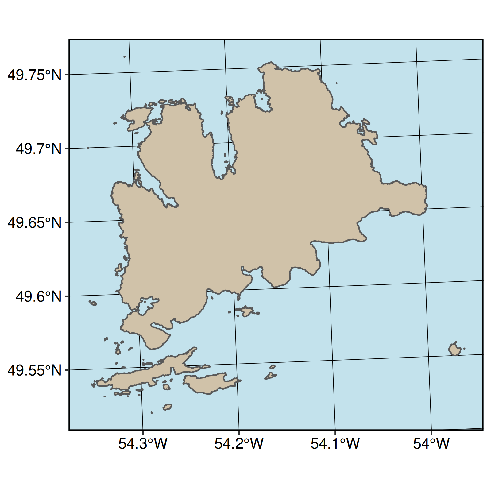

# study-area-figures

Collecting WEEL study area figures in one place, for sharing\!

## Contributing:

1.  Clone the repository
2.  Add your script (follow the numbering scheme)
3.  Add the output figure to `graphics/`, with a name and number
    matching the script it originates from.
4.  (Ideally) add the figure to the `README.Rmd` so we can preview them
    all together in one spot.

**Note: currently the input folder is ignored, if you have small data
you’d like to share, carefully remove it from the `.gitignore`**

## Currently:

1.  Fogo Island

This uses data from Open Street Map and three packages: `sf`,
`data.table` and `ggplot`.

``` r

```


