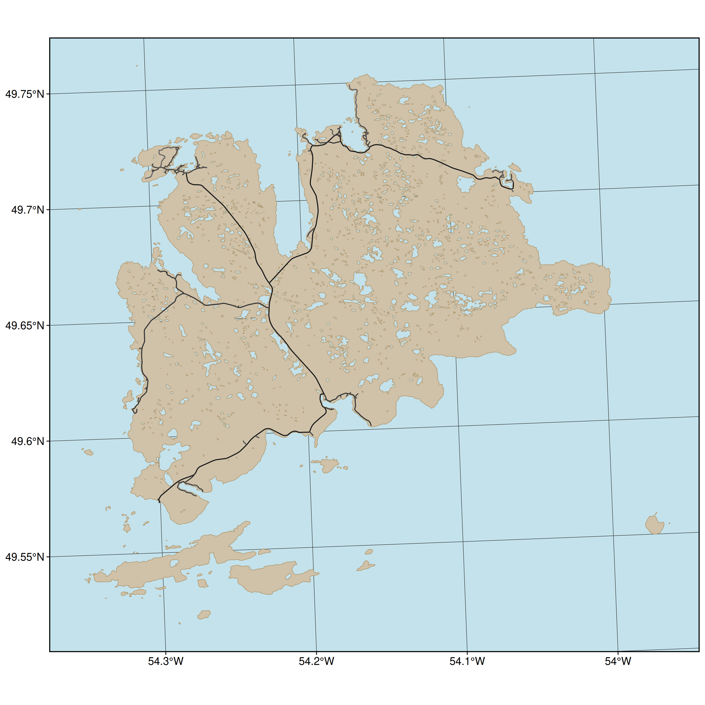
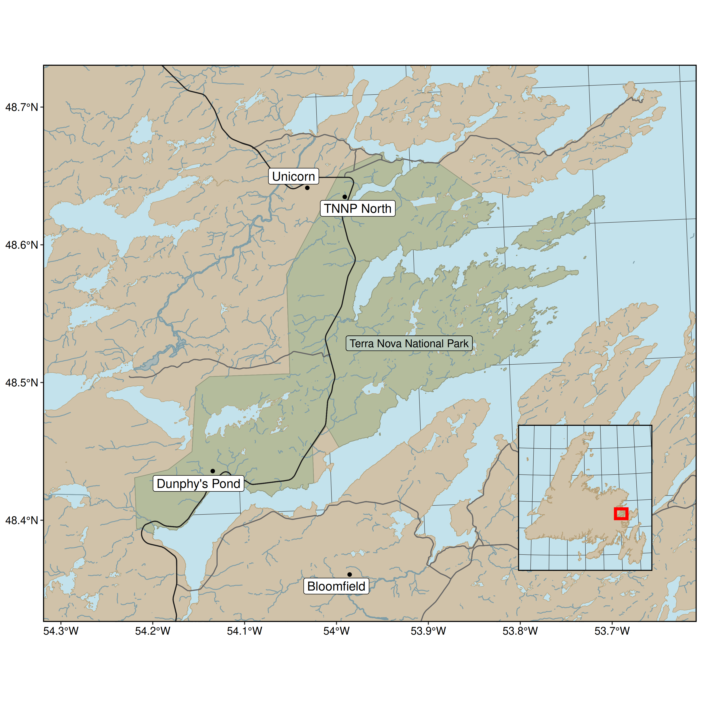

# study-area-figures

Collecting WEEL study area figures in one place, for sharing\!

## Contributing:

1.  Clone the repository
2.  Add your script (follow the numbering scheme)
3.  Add the output figure to `graphics/`, with a name and number
    matching the script it originates from.
4.  (Ideally) add the figure to the `README.Rmd` so we can preview them
    all together in one spot.

**Note: currently the input folder is ignored, if you have small data
you’d like to share, carefully remove it from the `.gitignore`**

Also, we output the features to `.gpkg` (GeoPackage) because…
[shapefiles are hell](http://switchfromshapefile.org).

Also\! I made a bash script for rerunning all the figures. If you want
to try it, let me know.

## Currently:

1.  Fogo Island

This uses data from Open Street Map and four packages: `osmdata`, `sf`,
`data.table` and `ggplot`.

Reproducing: run `01-fogo-island-prep.R` to generate the islands polygon
and `02-fogo-island-figure.R` to generate the figure.

``` r

```


2.  Newfoundland

This uses data from Open Street Map and four packages: `osmdata`, `sf`,
`data.table` and `ggplot`.

Reproducing: run `03-newfoundland-prep.R` to generate the islands
polygon and `04-newfoundland-figure.R` to generate the figure.

Note: this map doesn’t show internal water. Let me know if that’s
something you’d like to add.

``` r
knitr::include_graphics('graphics/04-newfoundland.png')
```


3.  Fogo with Newfoundland inset

This uses data from Open Street Map and four packages: `osmdata`, `sf`,
`data.table` and `ggplot`.

Reproducing: run `01-fogo-island-prep.R`, `03-newfoundland-prep.R`, to
generate the Fogo and NL polygons and
`04-fogo-inset-newfoundland-figure.R` to combine and generate the
figure.

``` r
knitr::include_graphics('graphics/05-fogo-inset-nl.png')
```


4.  Terra Nova

This uses data from GeoGratis and Open Street Map and six packages:
`osmdata`, `curl`, `zip`, `sf`, `data.table` and `ggplot`.

Reproducing: run `03-newfoundland-prep.R` and `06-terra-nova-prep.R` to
generate the NL and TN polygons and `07-terra-nova-figure.R` to combine
and generate the figure.

``` r
knitr::include_graphics('graphics/07-terra-nova.png')
```


4.  Terra Nova Bunny Grids

This uses data from GeoGratis and Open Street Map and six packages:
`osmdata`, `curl`, `zip`, `sf`, `data.table` and `ggplot`.

Reproducing: run `03-newfoundland-prep.R` and `06-terra-nova-prep.R` to
generate the NL and TN polygons and `08-terra-nova-buns-figure.R` to
combine and generate the figure.

``` r

```


