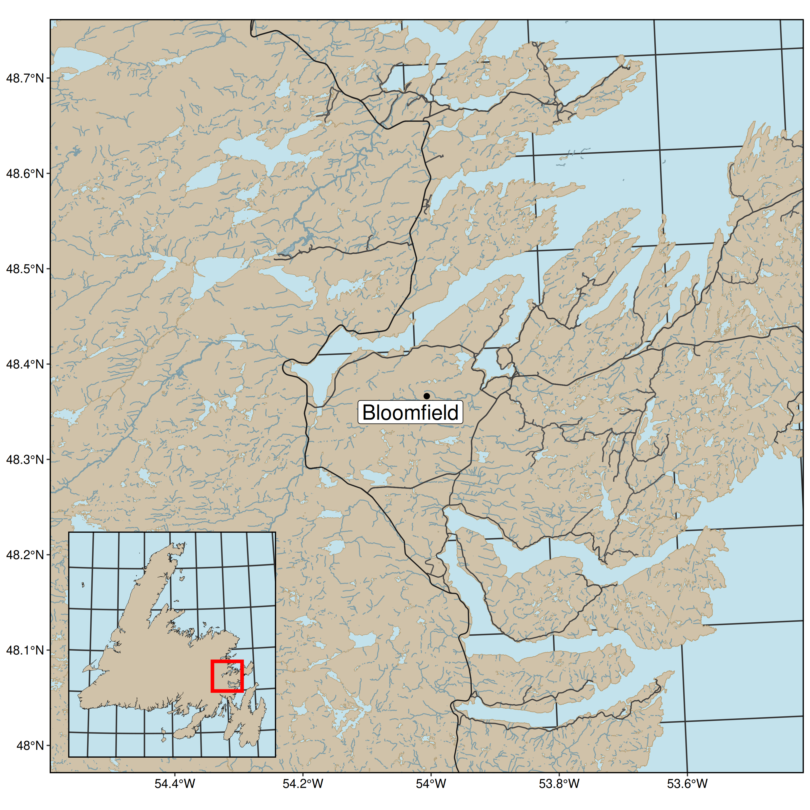
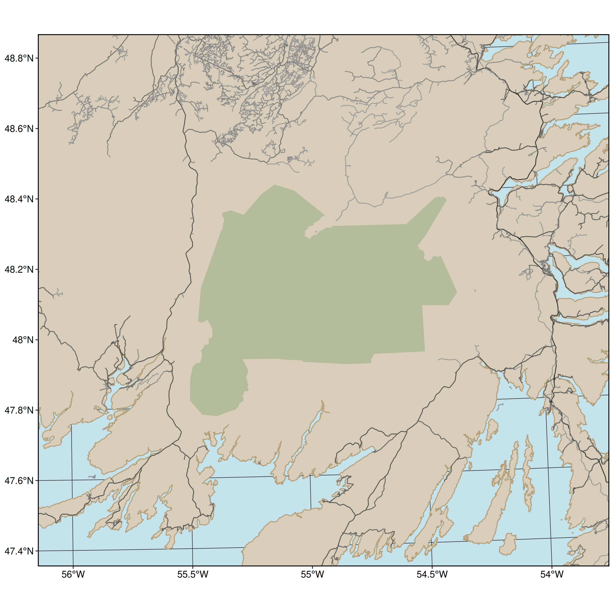
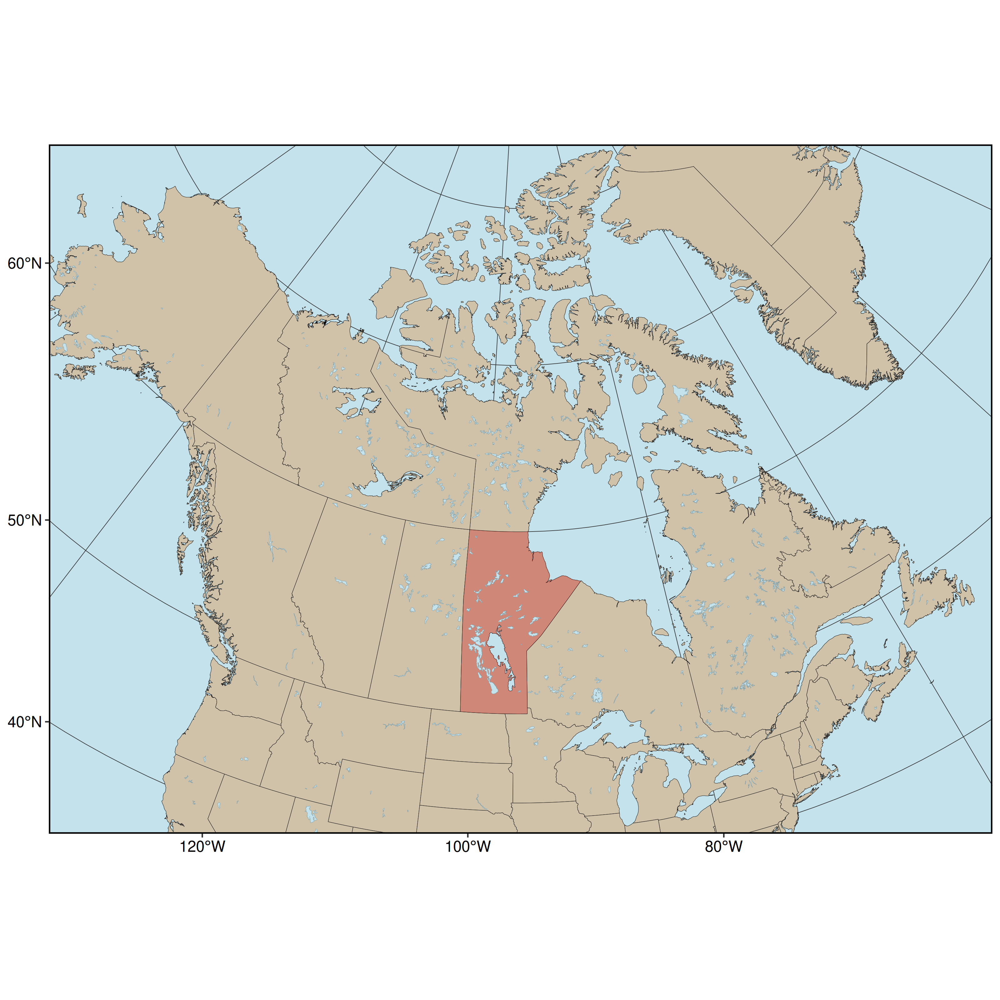

study-area-figures
================

- [Contributing](#contributing)
- [Citing](#citing)
- [Figures](#figures)
  - [Newfoundland](#newfoundland)
    - [Fogo Island](#fogo-island)
    - [Fogo with Newfoundland inset](#fogo-with-newfoundland-inset)
    - [Terra Nova](#terra-nova)
    - [Terra Nova Bunny Grids](#terra-nova-bunny-grids)
    - [Bloomfield](#bloomfield)
    - [Middle Ridge](#middle-ridge)
    - [Middle Ridge Inset](#middle-ridge-inset)
    - [Butter Pot](#butter-pot)
  - [Manitoba](#manitoba)
    - [Riding Mountain National Park](#riding-mountain-national-park)
    - [RMNP with Manitoba Inset](#rmnp-with-manitoba-inset)
  - [Circumpolar](#circumpolar)
    - [Caribou diet](#caribou-diet)

Collecting WEEL study area figures in one place, for sharing! These
should be a good foundation for more specific figures. And a useful
resource for spatial plotting, and downloading open spatial data from
OSM, Natural Earth and government sources.

[](https://doi.org/10.5281/zenodo.3979666)

# Contributing

1.  Clone the repository
2.  Make a new branch and pull request (ask Alec)
3.  Add your script (follow the numbering scheme)
4.  Add the output figure to `graphics/`, with a name and number
    matching the script it originates from
5.  Add the figure to the `README.Rmd` so we can preview them all
    together in one spot

**Note: currently the input folder is ignored, if you have small data
you’d like to share, carefully remove it from the `.gitignore`**

Also, we output the features to `.gpkg` (GeoPackage) because…
[shapefiles are hell](http://switchfromshapefile.org).

Also! I made a bash script for rerunning all the figures. If you want to
try it, let me know.

# Citing

If you use or adapt one of these figures in your own work, please cite
the project. See the Zenodo record for details:
<https://doi.org/10.5281/zenodo.3979666>.

# Figures

## Newfoundland

This uses data from Open Street Map and packages: `osmdata`, `sf`,
`data.table` and `ggplot`.

Reproducing: run `03-newfoundland-prep.R` to generate the islands
polygon and `04-newfoundland-figure.R` to generate the figure.

Note: this map doesn’t show internal water. Let me know if that’s
something you’d like to add.

``` r
knitr::include_graphics('graphics/04-newfoundland.png')
```


### Fogo Island

This uses data from Open Street Map and packages: `osmdata`, `sf`,
`data.table` and `ggplot`.

Reproducing: run `01-fogo-island-prep.R` to generate the islands polygon
and `02-fogo-island-figure.R` to generate the figure.

``` r
knitr::include_graphics('graphics/02-fogo-island.png')
```


### Fogo with Newfoundland inset

This uses data from Open Street Map and packages: `osmdata`, `sf`,
`data.table` and `ggplot`.

Reproducing: run `01-fogo-island-prep.R`, `03-newfoundland-prep.R`, to
generate the Fogo and NL polygons and
`04-fogo-inset-newfoundland-figure.R` to combine and generate the
figure.

``` r
knitr::include_graphics('graphics/05-fogo-inset-nl.png')
```


### Terra Nova

This uses data from GeoGratis and Open Street Map and packages:
`osmdata`, `curl`, `zip`, `sf`, `data.table` and `ggplot`.

Reproducing: run `03-newfoundland-prep.R` and `06-terra-nova-prep.R` to
generate the NL and TN polygons and `07-terra-nova-figure.R` to combine
and generate the figure.

``` r
knitr::include_graphics('graphics/07-terra-nova.png')
```


### Terra Nova Bunny Grids

This uses data from GeoGratis and Open Street Map and packages:
`osmdata`, `curl`, `zip`, `sf`, `data.table` and `ggplot`.

Reproducing: run `03-newfoundland-prep.R` and `06-terra-nova-prep.R` to
generate the NL and TN polygons and `08-terra-nova-buns-figure.R` to
combine and generate the figure.

``` r
knitr::include_graphics('graphics/08-terra-nova-buns.png')
```


### Bloomfield

This uses data from Open Street Map and packages: `osmdata`, `curl`,
`zip`, `sf`, `data.table` and `ggplot`.

Reproducing: run `03-newfoundland-prep.R` and `06-terra-nova-prep.R` to
generate the NL and TN polygons and `09-bloomfield-figure.R` to combine
and generate the figure.

``` r

```


### Middle Ridge

This uses data from Open Street Map and Newfoundland Government and
packages: `osmdata`, `sf`, `data.table`, `ggrepel` and `ggplot`.

Reproducing: run `03-newfoundland-prep.R` and `15-middle-ridge-prep.R`
to generate the MR and NL data and `16-middle-ridge-figure.R` to
generate the figure.

``` r

```


### Middle Ridge Inset

This uses data from Open Street Map, Natural Earth and Newfoundland
Government and packages: `osmdata`, `rnaturalearth`, `sf`, `data.table`,
`ggrepel` and `ggplot`.

Reproducing: run `03-newfoundland-prep.R`, `12-manitoba-prep.R` and
`15-middle-ridge-prep.R` to generate the MR and NL data and
`17-middle-ridge-inset-figure.R` to generate the figure.

``` r
knitr::include_graphics('graphics/17-middle-ridge-inset.png')
```


### Butter Pot

This uses data from Open Street Map, Natural Earth and Newfoundland
Government and packages: `osmdata`, `sf`, `data.table`, `sfheaders` and
`ggplot`.

Reproducing: run `03-newfoundland-prep.R`, and `22-butter-pot-prep.R` to
generate the MR and NL data and `23-butter-pot-figure.R` to generate the
figure.

``` r

```


## Manitoba

This uses data from Natural Earth and packages: `rnaturalearth`, `sf`,
`data.table` and `ggplot`.

Reproducing: run `12-manitba-prep.R` to generate the MB data and
`13-manitoba-figure.R` to combine and generate the figure.

``` r

```


### Riding Mountain National Park

This uses data from Open Street Map and packages: `osmdata`, `sf`,
`data.table` and `ggplot`.

Reproducing: run `10-riding-mountain-prep.R` to generate the RMNP data
and `11-riding-mountain-figure.R` to combine and generate the figure.

``` r
knitr::include_graphics('graphics/11-riding-mountain.png')
```


### RMNP with Manitoba Inset

This uses data from Open Street Map and Natural Earth and packages:
`osmdata`, `rnaturalearth`, `sf`, `data.table` and `ggplot`.

Reproducing: run `10-riding-mountain-prep.R` and `12-manitoba-prep.R` to
generate the RMNP and MB data and `14-riding-mountain-inset-figure.R` to
generate the figure.

``` r
knitr::include_graphics('graphics/14-riding-mountain-inset.png')
```


## Circumpolar

### Caribou diet

This uses data from Open Street Map and Natural Earth and packages:
`osmdata`, `rnaturalearth`, `sf`, `data.table` and `ggplot`.

Reproducing: run `19-Caribou-diet-North-America-prep.R` and
`20-Caribou-diet-Europe-prep.R` to generate the data and
`21-Canada-caribou-diet-figure.R` to generate the figure.

``` r

```


